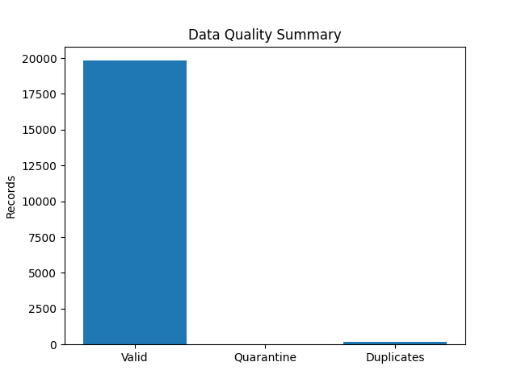
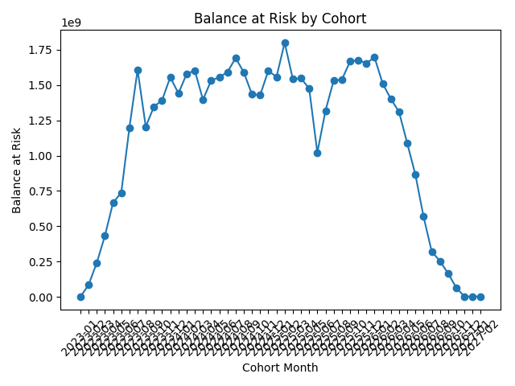

# 📊 Data Pipeline Report

**Execution time:** 2026-01-20 17:56:43

## 1️⃣ Execution Summary
- Bronze path: `data\bronze\credit_events`
- Silver path: `data\silver`
- Gold path: `data\gold\marts`
- Micro-batches processed: **1**

## 2️⃣ Records by Medallion Layer
- Bronze records: **20000**
- Silver valid records: **19992**
- Silver quarantine records: **0**
- Gold records: **2000**

## 3️⃣ Data Quality
- Duplicate events detected: **169**
- Invalid DPD records: **97**
- Invalid balance records: **0**
- Invalid interest rate records: **29**

### Null percentage (critical fields)
- loan_id: **0.0%**
- customer_id: **0.0%**
- event_time: **0.0%**

## 4️⃣ Visualizations
### Data Quality Overview

### Balance at Risk by Cohort

