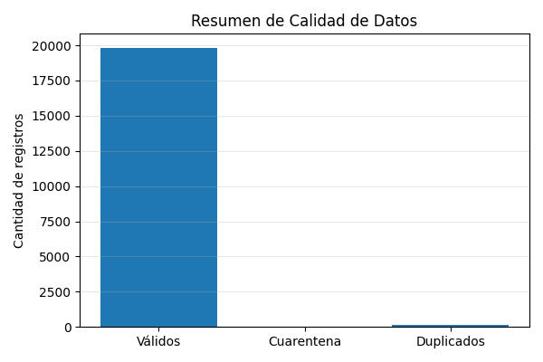
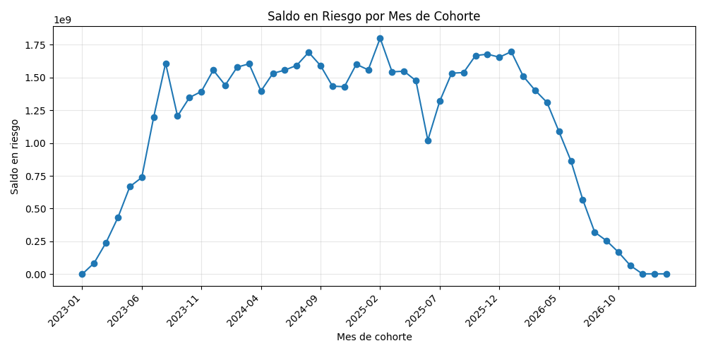

# 📊 Reporte del Pipeline de Datos

**Fecha y hora de ejecución:** 2026-01-20 18:06:34

## 1️⃣ Resumen de Ejecución
Este reporte presenta un resumen del estado final del pipeline implementado bajo una arquitectura Medallion (Bronze, Silver, Gold).

**Parámetros de ejecución:**
- Ruta Bronze: `data\bronze\credit_events`
- Ruta Silver: `data\silver`
- Ruta Gold: `data\gold\marts`
- Micro-batches procesados en Bronze: **1**

## 2️⃣ Métricas por Capa (Medallion)
- Registros en Bronze: **20000**
- Registros válidos en Silver: **19992**
- Registros enviados a cuarentena (Silver): **0**
- Registros finales en Gold: **2000**

## 3️⃣ Calidad de Datos
### Reglas de validación aplicadas
- Registros duplicados detectados: **169**
- Registros con días de mora inválidos: **97**
- Registros con saldo inválido: **0**
- Registros con tasa de interés inválida: **29**

### Porcentaje de valores nulos en campos críticos
- loan_id: **0.0%**
- customer_id: **0.0%**
- event_time: **0.0%**

## 4️⃣ Visualizaciones
Las siguientes visualizaciones permiten evaluar rápidamente la calidad del pipeline y el valor analítico de la capa Gold.

### Resumen de calidad de datos

### Saldo en riesgo por mes de cohorte

